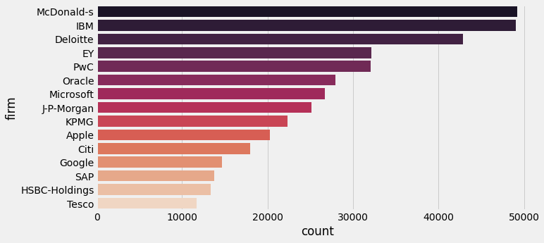
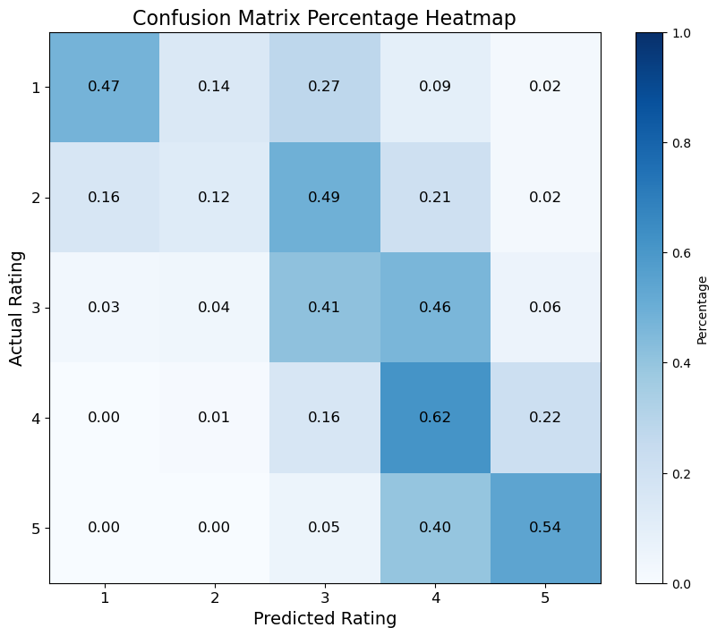

# Machine Learning Project: Glassdoor Job Reviews Dataset

## Overview

This project focuses on implementing a machine learning model following the machine learning life cycle. The primary goal is to predict job ratings based on employee reviews from the Glassdoor dataset. The project will use text-based natural language processing (NLP) and numerical feature-based techniques to build a predictive model.

## Project Structure

### 1. **Dataset**
The dataset used is the *Glassdoor Job Reviews Dataset*, which contains reviews from employees about various companies. The dataset includes the following features:
- **Firm**: Name of the company.
- **Date Review**: Date of the review.
- **Job Title**: Position of the reviewer.
- **Current**: Whether the employee is currently working for the company.
- **Location**: Location of the job.
- **Overall Rating**: Rating of the company (Label).
- **Work-life balance, Culture values, Diversity inclusion, Career opportunities, Compensation & benefits, Senior management**: Numerical ratings from the reviews.
- **Headline, Pros, Cons**: Text-based reviews.

Top 16 Companies with Most Reviews

The image below shows the top 16 companies with the most reviews in the Glassdoor dataset.

Image source: Kaggle Notebook by *David Gauthier*

### 2. **Problem Definition**
The goal is to predict the **overall job rating** based on text reviews and other features. This is a **supervised classification problem** where the rating ranges from 1 to 5.

### 3. **Data Preparation**
- Load and clean the dataset using **Pandas**.
- Perform feature engineering by creating new features such as `review_text` by combining the headline, pros, and cons.
- Handle missing data, converting numerical columns into appropriate data types.
- Perform **Natural Language Processing (NLP)** using **TF-IDF vectorization** on text reviews.

### 4. **Machine Learning Model**
The project uses a **Neural Network** model implemented using **TensorFlow/Keras**:
- The model consists of an input layer, three hidden layers, and an output layer using the softmax activation function for classification.
- Other models considered include **Logistic Regression** and **Random Forest Classifier**.

### 5. **Model Training & Evaluation**
- Train the model using 75% of the data, with 25% of the training data reserved for validation.
- Evaluate the model's performance on the test set using accuracy, precision, recall, F1-score, and confusion matrix.
- Perform hyperparameter tuning and model selection to improve performance.

### 6. **Results**

- The model achieved an accuracy of around **50.7%** on the test set, with further improvements possible through additional feature engineering and hyperparameter tuning.
- The neural network model performed well in predicting higher job ratings but had challenges with lower ratings.

#### Confusion Matrix Analysis

The confusion matrix provides a detailed view of how predictions are distributed across the five different rating classes. Each cell represents the percentage of instances classified into a particular rating.

- **Diagonal Cells**: Represent correct classifications where the predicted rating matches the actual rating:
  - **Rating 1**: 47% correctly predicted.
  - **Rating 2**: 49% correctly predicted.
  - **Rating 3**: 41% correctly predicted.
  - **Rating 4**: 62% correctly predicted.
  - **Rating 5**: 54% correctly predicted.

- **Off-Diagonal Cells**: Indicate misclassifications where the predicted rating does not match the actual rating:
  - The model often confuses ratings 1 and 3, with 27% of actual rating 1 being predicted as rating 3, and 14% as rating 2.
  - There is significant spillover between adjacent ratings. For example, 46% of actual rating 3 instances are predicted as rating 4.
  - The model sometimes overestimates ratings, with 22% of actual rating 4 instances classified as rating 5 and 9% of rating 1 instances misclassified as rating 4.

**Interpretation and Next Steps**

- **Model Strengths**: The model performs relatively well on ratings 4 and 5, with the highest correct classification percentages (62% and 54%, respectively). This suggests that the features used are effective for distinguishing higher ratings.
  
- **Model Weaknesses**: There is noticeable confusion between lower ratings (1 to 3). For instance, a significant portion of rating 1 samples is being classified as rating 3 (27%), and rating 3 is being classified as rating 4 (46%). This indicates a need for better differentiation between dissatisfaction and mid-level satisfaction.

- **Potential Improvements**:
  - **Feature Engineering**: More detailed feature engineering could help the model better differentiate between similar ratings, especially between 1 and 3, and 3 and 4.
  - **Text Preprocessing**: Enhancing text feature processing using advanced NLP techniques (e.g., word embeddings or fine-tuned transformers) might improve understanding of subtle differences in reviews.
  - **Model Complexity**: Using more complex models or fine-tuning hyperparameters could reduce misclassifications, particularly between adjacent ratings.

By addressing these areas, the model’s accuracy and prediction precision could improve, leading to better differentiation between ratings.

### 7. **Conclusion**
This project demonstrates the full machine learning life cycle, from data preparation and feature engineering to model training and evaluation. The model provides insights into how companies can improve employee satisfaction by understanding the factors contributing to overall job ratings.
